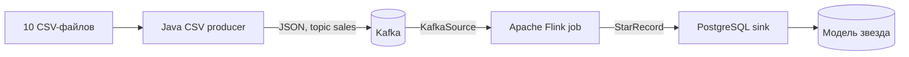

# BigDataFlink
/home/roman/BDSnowflake
Лабораторная работа №3: потоковая обработка продаж на Apache Flink.

Приложение читает десять CSV-файлов из `исходные данные`, отправляет каждую строку как JSON-сообщение в Kafka, а Flink в потоковом режиме преобразует события в модель «звезда» и загружает измерения и факты в PostgreSQL.


## Состав проекта

- `src/main/java/ru/bigdata/flink/CsvToKafkaProducer.java` читает CSV и отправляет JSON в топик `sales`.
- `src/main/java/ru/bigdata/flink/FlinkStarJob.java` читает Kafka и преобразует события.
- `src/main/java/ru/bigdata/flink/PostgresStarSink.java` сохраняет записи в PostgreSQL.
- `postgres/init.sql` создает измерения и таблицу фактов.
- `docker-compose.yml` поднимает PostgreSQL, Kafka, Flink JobManager и TaskManager.

Для ключа продажи используются имя исходного файла и номер строки в нём: поле `id` начинается заново в каждом CSV. Поэтому ключ факта остаётся уникальным, а повторный запуск producer не создаёт дубликаты в `fact_sales`.

## Запуск

Нужны Docker с Compose v2. Команды выполняются из корня репозитория:

```bash
docker compose up -d --build postgres kafka jobmanager taskmanager

docker compose exec kafka kafka-topics --bootstrap-server kafka:29092 \
	--create --if-not-exists --topic sales --partitions 1 --replication-factor 1

docker compose exec jobmanager flink run -d \
	-c ru.bigdata.flink.FlinkStarJob /opt/flink/usrlib/flink-star-streaming.jar

docker compose --profile producer run --rm producer
```

Producer отправляет все 10 000 строк из десяти CSV. Страницу Flink можно открыть по адресу [http://localhost:8081](http://localhost:8081). PostgreSQL доступен на `localhost:5432`, база и учётные данные: `sales` / `sales`.

## Проверка

После обработки в таблице фактов должно быть 10 000 строк:

```bash
docker compose exec postgres psql -U sales -d sales \
	-c "SELECT COUNT(*) FROM fact_sales;"
```

Для приложенного набора CSV контрольные значения: 54 623 проданные единицы, выручка `2 529 852.12`; таблица дат содержит 364 даты. В измерениях клиентов, продавцов, товаров, магазинов и поставщиков по 10 000 строк.

Проверить измерения и итог продаж:

```bash
docker compose exec postgres psql -U sales -d sales -c \
	"SELECT (SELECT COUNT(*) FROM dim_customer) AS customers,
					(SELECT COUNT(*) FROM dim_product) AS products,
					(SELECT COUNT(*) FROM fact_sales) AS sales,
					(SELECT SUM(quantity) FROM fact_sales) AS items_sold,
					(SELECT SUM(total_price) FROM fact_sales) AS revenue;"
```

Остановить сервисы, сохранив данные PostgreSQL:

```bash
docker compose down
```

Полностью очистить хранилище и начать заново:

```bash
docker compose down -v
```

## Требования лабораторной

В репозитории есть исходные CSV, Docker Compose для PostgreSQL, Flink и Kafka, приложение-источник CSV → JSON → Kafka, Flink job для streaming-трансформации и инструкция для запуска и проверки результата.

## Отчёт о решении

### Цель работы

Реализовать потоковую обработку продаж: прочитать CSV-файлы, передать строки в Kafka в формате JSON, преобразовать события приложением Apache Flink в модель «звезда» и сохранить данные в PostgreSQL.

### Исходные данные

В каталоге `исходные данные` находятся десять CSV-файлов по 1 000 записей, всего 10 000 строк и 50 столбцов. В описаниях товаров встречаются значения с запятыми и переносами строк, поэтому producer разбирает CSV-поля, а не делит строки вручную.

Поле `id` повторяется между файлами и не является ключом всей загрузки. Для каждой записи сохраняются имя исходного файла и номер записи в этом файле. Пара `source_file`, `source_row` используется для воспроизводимого ключа продажи.

Проверка форматов показала, что обязательные числовые поля и даты разбираются без ошибок, а ключевые поля клиента, продавца, магазина и поставщика заполнены во всех строках.

### Архитектура



Producer читает CSV через Apache Commons CSV и отправляет по одному JSON-сообщению на каждую запись. Kafka message key строится из имени файла и номера строки. Flink читает топик `sales`, десериализует JSON, создаёт ключи измерений и даты, затем передаёт результат в sink PostgreSQL.

Основные файлы реализации:

- `src/main/java/ru/bigdata/flink/CsvToKafkaProducer.java` — чтение CSV и публикация JSON-событий.
- `src/main/java/ru/bigdata/flink/FlinkStarJob.java` — Kafka source, преобразование потока и checkpointing.
- `src/main/java/ru/bigdata/flink/SaleEvent.java` — структура события и преобразование значений CSV к типам Java.
- `src/main/java/ru/bigdata/flink/StarRecord.java` — ключи модели «звезда» и преобразование дат.
- `src/main/java/ru/bigdata/flink/PostgresStarSink.java` — транзакционная запись измерений и фактов.
- `postgres/init.sql` — DDL таблиц и внешних ключей.
- `docker-compose.yml` — PostgreSQL, Kafka, JobManager, TaskManager и producer.

### Модель «звезда»

Таблица фактов `fact_sales` хранит количество и сумму продажи, источник записи и внешние ключи. Она связана с шестью измерениями:

| Таблица | Содержание |
|---|---|
| `dim_customer` | Покупатель и сведения о его питомце |
| `dim_seller` | Продавец |
| `dim_product` | Товар, категории, цена и атрибуты товара |
| `dim_store` | Магазин и его местоположение |
| `dim_supplier` | Поставщик |
| `dim_date` | Дата, день, месяц, квартал и год |

Ключи измерений и продажи детерминированы: одинаковое событие при повторной обработке получает тот же UUID. PostgreSQL вставляет строки с `ON CONFLICT DO NOTHING`; запись одного события выполняется в транзакции. Это делает повторную доставку безопасной для таблиц фактов и измерений.

### Проверка результата

Проверка выполнена на всех десяти CSV в Docker Compose. Producer отправил 10 000 сообщений, Flink job перешла в `RUNNING`, все сервисы остались без рестартов.

| Показатель | Результат |
|---|---:|
| Строк в `fact_sales` | 10 000 |
| Уникальных пар источник/строка | 10 000 |
| Проданных единиц | 54 623 |
| Выручка | 2 529 852.12 |
| Строк в каждом бизнес-измерении | 10 000 |
| Строк в `dim_date` | 364 |
| Факты без связанного измерения | 0 |

После повторного запуска producer Kafka consumer offset достиг `20000` при `LOG-END-OFFSET 20000` и `LAG 0`. В PostgreSQL осталось 10 000 фактов с теми же суммами, что подтверждает идемпотентность повторной доставки.

### Итог

Реализован полный путь CSV → JSON → Kafka → Apache Flink → PostgreSQL. Результат соответствует объёму входного набора; контрольные суммы продаж совпали с проверками предыдущей лабораторной работы на том же наборе данных.
